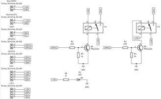
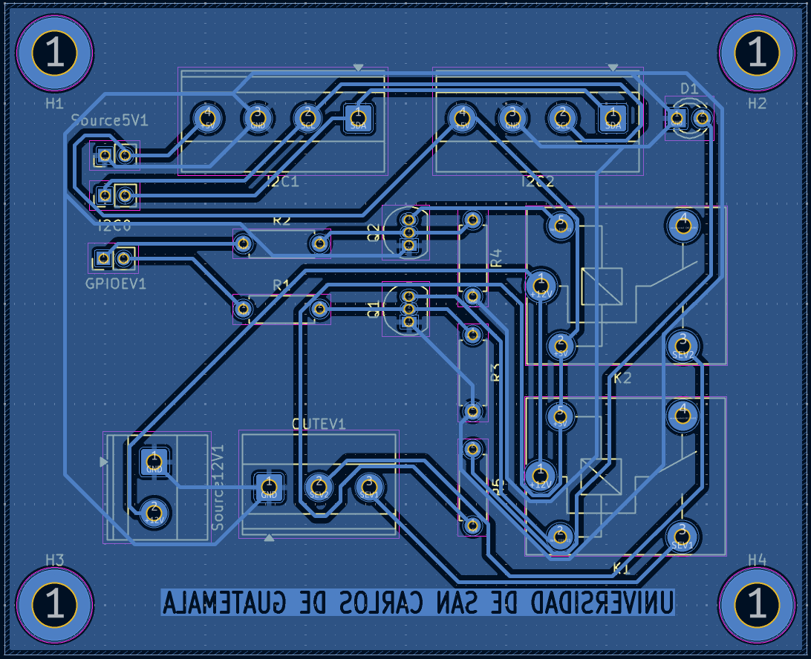
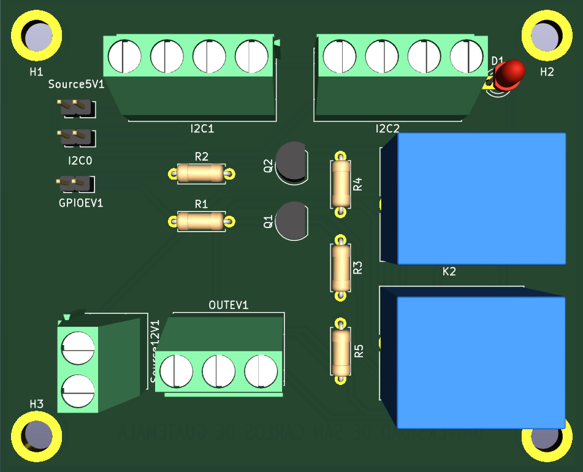

# 🌡️ HumidityControlSystem

Sistema inteligente de monitoreo y control de **humedad** y **temperatura**, desarrollado para el laboratorio de materiales de construcción del **Centro de Investigaciones de la Facultad de Ingeniería** de la **Universidad de San Carlos de Guatemala**.  
Está construido sobre **Raspberry Pi**, utilizando **Python**, **Django** y sensores digitales **AHT10**.

---

## 🚀 Tecnologías utilizadas

---

## 📷 Vista del hardware

A continuación, se muestran las representaciones visuales de la PCB utilizada:

| Diagrama esquemático | Ruteo de la PCB | Vista 3D de la PCB |
|----------------------|-----------------|---------------------|
|  |  |  |

---

## 🌡️ Sensor utilizado – AHT10

Este proyecto utiliza el sensor digital **AHT10**, que permite la medición precisa de **humedad relativa** y **temperatura**.  
Se comunica mediante el protocolo **I2C** y ofrece alta fiabilidad y bajo consumo energético.

- **Precisión de temperatura**: ±0.3 °C  
- **Precisión de humedad**: ±2 %RH  
- **Voltaje de operación**: 1.8V – 3.6V (alimentado a 5V mediante un regulador)

En este sistema, los sensores típicamente se detectan en las direcciones I2C **`0x38`** y **`0x39`**.

---

## 🧷 Pines GPIO (Raspberry Pi 3) – Uso en el proyecto

| Físico | Función           | Uso en el proyecto                              |
|--------|--------------------|--------------------------------------------------|
| 1      | 3.3V               | ----                                             |
| 2      | 5V                 | **Alimentación del sensor (+5V)**               |
| 3      | GPIO2 (SDA)        | **I2C – Línea de datos (SDA)**                  |
| 4      | 5V                 | **Alimentación del sensor (+5V)**               |
| 5      | GPIO3 (SCL)        | **I2C – Línea de reloj (SCL)**                  |
| 6      | GND                | **Tierra (GND)**                                |
| 7      | GPIO4              | ----                                             |
| 8      | GPIO14 (TXD)       | ----                                             |
| 9      | GND                | ----                                             |
| 10     | GPIO15 (RXD)       | ----                                             |
| 11     | GPIO17             | ----                                             |
| 12     | GPIO18             | ----                                             |
| 13     | GPIO27             | ----                                             |
| 14     | GND                | ----                                             |
| 15     | GPIO22             | ----                                             |
| 16     | GPIO23             | ----                                             |
| 17     | 3.3V               | ----                                             |
| 18     | GPIO24             | ----                                             |
| 19     | GPIO10 (MOSI)      | ----                                             |
| 20     | GND                | ----                                             |
| 21     | GPIO9 (MISO)       | ----                                             |
| 22     | GPIO25             | ----                                             |
| 23     | GPIO11 (SCLK)      | ----                                             |
| 24     | GPIO8 (CE0)        | ----                                             |
| 25     | GND                | ----                                             |
| 26     | GPIO7 (CE1)        | ----                                             |
| 27     | ID_SD (GPIO0)      | ----                                             |
| 28     | ID_SC (GPIO1)      | ----                                             |
| 29     | GPIO5              | ----                                             |
| 30     | GND                | ----                                             |
| 31     | GPIO6              | ----                                             |
| 32     | GPIO12             | ----                                             |
| 33     | GPIO13             | ----                                             |
| 34     | GND                | ----                                             |
| 35     | GPIO19             | ----                                             |
| 36     | GPIO16             | **Salida digital – Activa electroválvula 1**   |
| 37     | GPIO26             | ----                                             |
| 38     | GPIO20             | ----                                             |
| 39     | GND                | ----                                             |
| 40     | GPIO21             | ----                                             |

## 📚 Comandos útiles y documentación para mantenimiento

Esta sección agrupa comandos importantes para la gestión y diagnóstico del sistema, para facilitar el mantenimiento y solución de problemas.

---

### 🔌 Gestión y estado de servicios

- `sudo systemctl status django_server.service`  
  Verifica el estado actual del servicio `django_server`. Útil para saber si está activo, detenido o con errores.

- `sudo systemctl start django_server.service`  
  Inicia el servicio `django_server`.

- `sudo systemctl stop django_server.service`  
  Detiene el servicio `django_server`.

- `sudo systemctl restart django_server.service`  
  Reinicia el servicio `django_server`.

---

### 🌐 Monitoreo de red y procesos relacionados

- `ip a`  
  Muestra las interfaces de red y sus direcciones IP asignadas.

- `ps aux | grep runserver`  
  Busca procesos activos relacionados con el servidor de desarrollo (como Django).

- `sudo lsof -i :8000`  
  Lista los procesos que están usando el puerto 8000 (puerto típico del servidor Django).

---

### 📅 Configuración de fecha y hora

- `timedatectl`  
  Muestra el estado actual de la fecha, hora, zona horaria y sincronización NTP del sistema.

---

### 🔧 Comandos para inspección y control de GPIO

- `pinout`  
  Muestra el esquema de los pines GPIO de la Raspberry Pi en la terminal.

- `raspi-gpio set 16 op`  
  Configura el pin GPIO16 como salida (output).

- `raspi-gpio set 16 dh`  
  Activa el pin GPIO16 (lo pone en HIGH).

- `raspi-gpio set 16 dl`  
  Desactiva el pin GPIO16 (lo pone en LOW).

---

### 📊 Monitor de sistema y recursos

- `top`  
  Muestra en tiempo real los procesos activos y el uso de CPU, memoria, etc. Útil para detectar procesos que consumen muchos recursos.

---

### 🔍 Comandos I2C para sensores

- `sudo i2cdetect -y 1`  
  Escanea y muestra los dispositivos conectados al bus I2C 1, muy útil para verificar que el sensor de temperatura y humedad está correctamente conectado.  
  > En este proyecto, los sensores típicamente aparecen en las direcciones **0x38** y **0x39**.  
  > Si estos valores no aparecen, puede indicar un problema en la conexión o configuración del sensor.